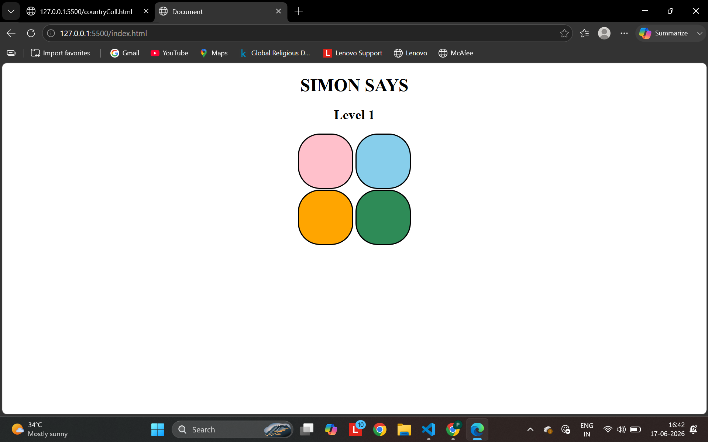

# 🎮 Simon Says Game

A simple Simon Says memory game built using HTML, CSS, and JavaScript.

## 🚀 Features

- Interactive gameplay
- Random color sequence generation
- User input validation
- Level tracking
- Game over and restart functionality

## 🛠️ Technologies Used

- HTML5
- CSS3
- JavaScript

## 📸 Screenshot



## 🎯 How to Play

1. Press any key to start the game.
2. Watch the highlighted color sequence.
3. Repeat the sequence by clicking the buttons.
4. The sequence gets longer every level.
5. Make a mistake and the game ends.

## 📂 Project Structure

```text
simon-says-game/
│
├── index.html
├── style.css
├── script.js
├── screenshot.png
└── README.md
```

## 👩‍💻 Author

Priya Shukla